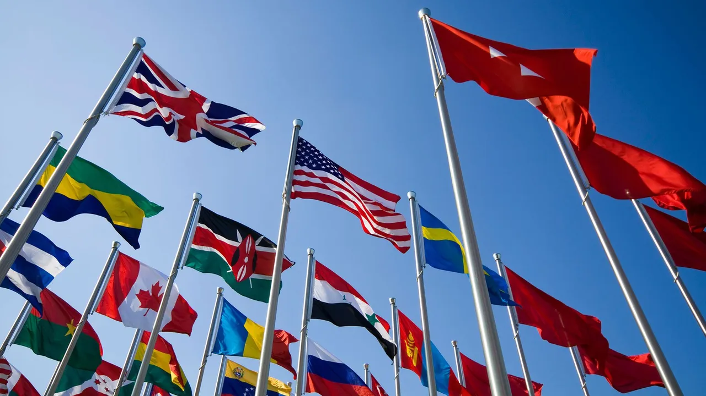

# The CSS Flags

Credits: 

The CSS Flags is a very simple project that I worked on to practice my CSS skills, and it was quite a lot of fun, if I'm being honest.

I mean, who has ever tried, as a kid, to draw or paint a country's flag, and felt thrilled by satisfaction? Or even used construction paper to build them? 😄

<h2> What's the Project About? </h2>

Essentially, The CSS Flags Project is just a simple website showing flags from countries that I harbor a particular interest in, which I designed entirely using HTML and CSS.

